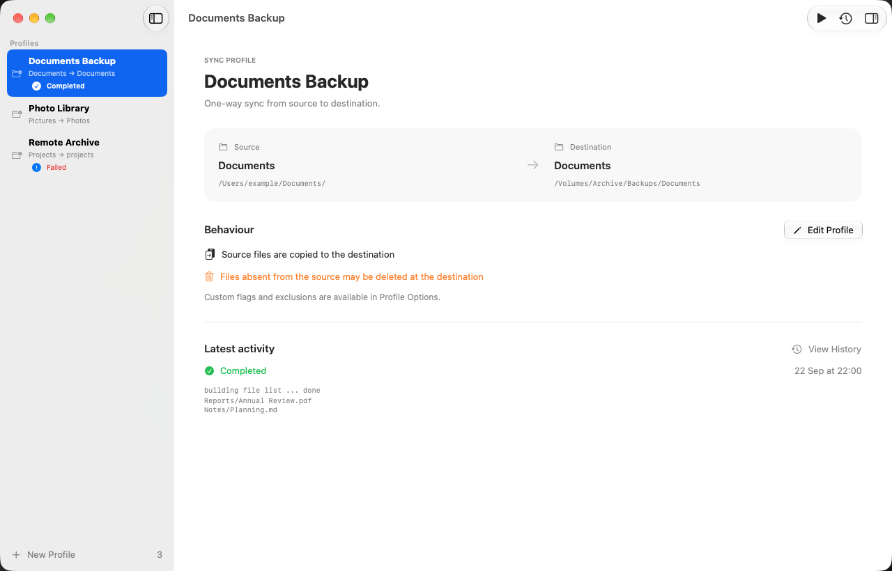

# rsync-manager

**A native macOS app for managing rsync backups and folder synchronization.**

Create reusable sync profiles, choose source and destination folders, and run backups from a familiar macOS interface. Review each profile’s behavior before running it, then inspect the output in your sync history.

[Website](https://rsync.cyberbison.dev) · [Support rsync-manager](https://ko-fi.com/cyberbison) · [Report an issue](https://github.com/CyberBison/rsync-manager/issues)



*The Documents Backup profile in Light appearance, with its folder paths, sync behavior, and latest activity in one view. Appearance follows your macOS settings.*

## Features

- **Reusable profiles**: Keep multiple backup and synchronization tasks organized in the sidebar.
- **Folder selection**: Choose source and destination folders or enter their paths directly.
- **Manual sync controls**: Run and stop syncs directly from the app.
- **Custom arguments and exclusions**: Configure rsync flags for each profile and inspect them in Profile Options.
- **Sync history**: Inspect, filter, search, and copy output from previous runs.
- **Native macOS interface**: Use keyboard shortcuts, inspectors, and system Light and Dark appearances.

The app is under active development. Scheduled backups and notifications are planned enhancements.

### **Key Features**
- **Task Management**: Create and configure multiple `rsync` tasks effortlessly.
- **Easy Folder Selection**: Select source and destination directories via a clean user interface.
- **Manual Execution**: Run and stop syncs directly from the app.
- **Sync History**: Inspect, filter, search, and copy output from previous runs.
- **Planned Enhancements**:
  - **Scheduled Backups**: Automate tasks on a customizable schedule.
  - **Notifications**: Get notified of sync progress and errors.

---

## Requirements

- **macOS**: Version 27 or higher for the redesigned source build
- **Xcode**: Version 27 with the macOS 27 SDK
- **Homebrew**: For easy installation (optional but recommended)

---

## Installation

### Option 1: Install via Homebrew
1. Tap the custom Homebrew repository:
   ```bash
   brew tap cyberbison/custombrew
   ```
2. Install the app:
   ```bash
   brew install --cask rsync-manager
   ```

### Option 2: Build from Source
1. Clone the repository:
   ```bash
   git clone https://github.com/CyberBison/rsync-manager.git
   cd rsync-manager
   ```
2. Open the project in Xcode:
   ```bash
   open rsync-manager.xcodeproj
   ```
3. Build and run the app.

---

## Getting Started

1. Create a **New Profile** from the sidebar or with **⇧⌘N**.
2. Enter a name and choose or type the source and destination paths. A trailing slash on the source copies its contents instead of the folder itself.
3. Expand **Advanced arguments & exclusions** to adjust the existing rsync flags. The default remains `-av --delete`; this can remove destination files that are absent from the source.
4. Select a profile and use **Run Sync** (**⌘R**). The app remains responsive while running; **Stop Sync** cancels the active process.
5. Open **History** (**⇧⌘H**) to filter runs, search output, and copy complete logs. Open **Profile Options** (**⌥⌘I**) to inspect saved arguments.
6. Right-click a profile to edit or delete it. Deleting a profile preserves its files and history.

The interface uses native macOS navigation, inspectors, sheets, and Liquid Glass controls. Appearance follows the system. Existing `sync_tasks.json` and `sync_logs.json` formats and storage locations are retained; older profiles without arguments still load with their original defaults.

### Development checks

Build and test with the shared `rsync-manager` scheme in Xcode 27. Unit tests cover legacy decoding, persistence, literal folder paths, process exit status, cancellation, and an actual sync between temporary folders. UI tests use isolated temporary data and capture the profile, inspector, editor, history, and Settings in Light and Dark appearances at 760- and 1280-point window widths. Test appearance and storage overrides are compiled only in Debug builds.

Run output is available after completion; the existing engine does not supply live file progress or persist durations. No estimated percentages or historical durations are invented.

---

## Contributing

Contributions are welcome! Feel free to submit issues or feature requests via the [GitHub Issues](https://github.com/CyberBison/rsync-manager/issues) page. For larger contributions, please fork the repository and submit a pull request.

---

## Support

If you encounter any issues or have questions, please reach out via [GitHub Discussions](https://github.com/CyberBison/rsync-manager/discussions).

---

## License

This project is licensed under the [GPL-3.0 License](https://www.gnu.org/licenses/gpl-3.0.en.html).

---

Thank you for using `rsync-manager`! 🚀
